# Sequence Diagrams

This document contains Mermaid sequence diagrams for the core runtime flows in the **Agentic Workflow Token Optimization Web App**.

---

## 1. Prompt Analysis — Happy Path (Cache Miss)

The end-to-end flow when a user clicks **"Analyze Tokens"** and the result is not in cache.

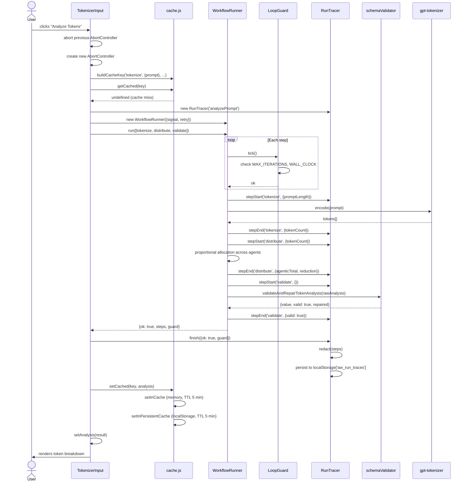

---

## 2. Prompt Analysis — Cache Hit

When an identical prompt has already been analysed within the TTL window.

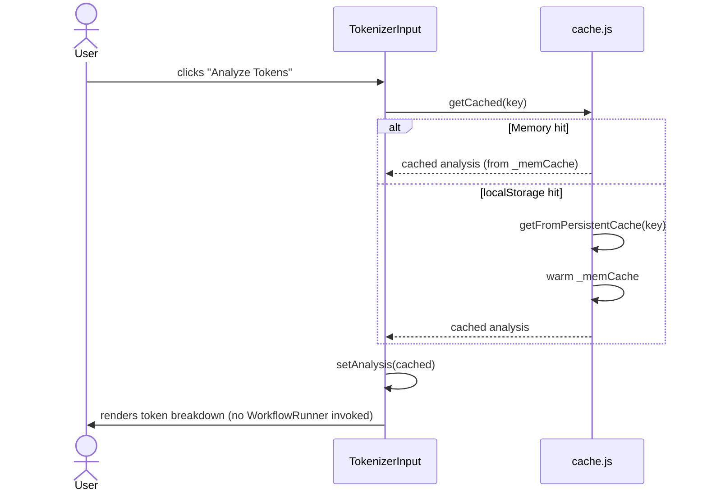

---

## 3. Retry Flow (Transient Failure)

When a step fails on the first attempt but succeeds on retry.

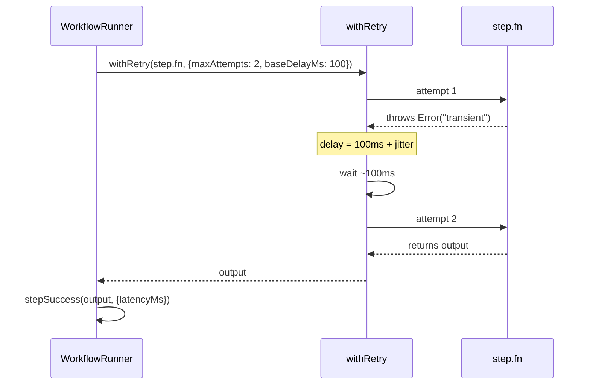

---

## 4. Loop Guard — Limit Exceeded

When the `WorkflowRunner` is given more steps than `MAX_ITERATIONS` allows.

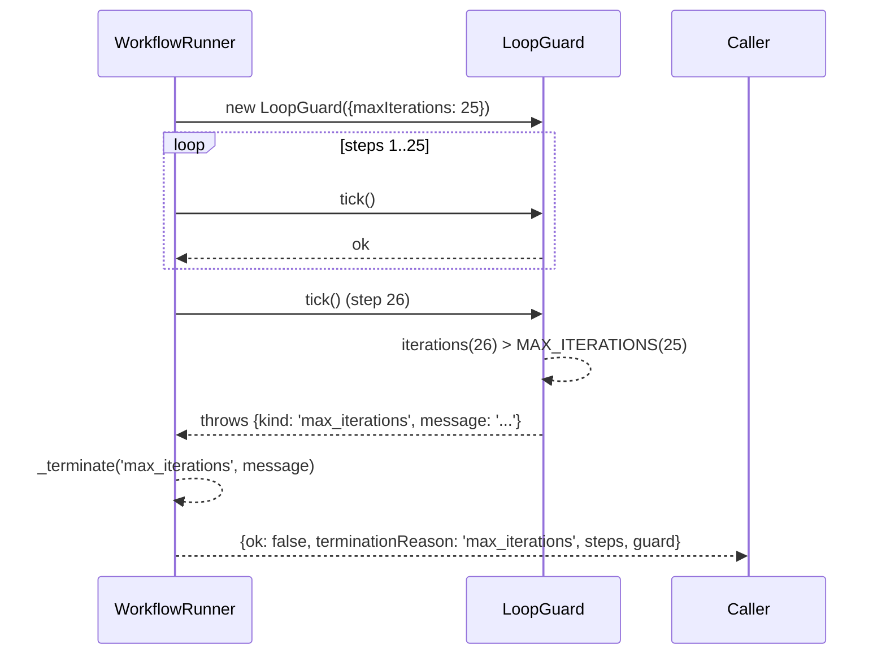

---

## 5. Cancellation Flow

When a new "Analyze" click arrives before the previous run completes.

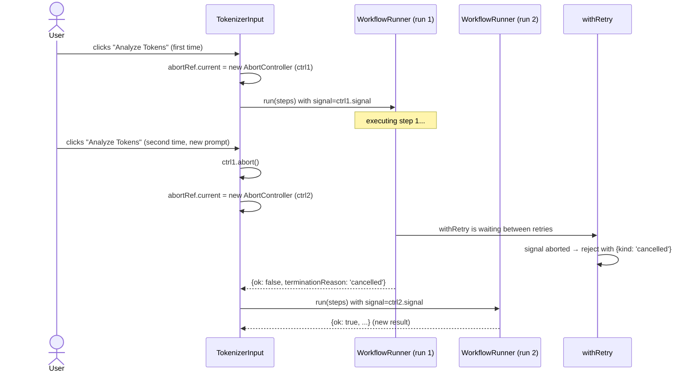

---

## 6. Schema Validation & Repair Flow

The validate step inside `WorkflowRunner` for a partially malformed analysis object.

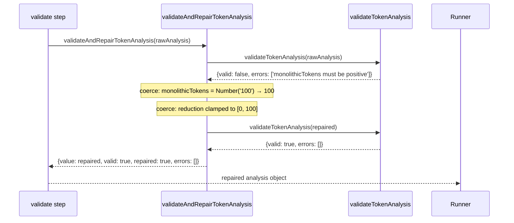

---

## 7. Run Trace — Persisting & Viewing

How a trace flows from execution to the `RunTrace` UI panel.

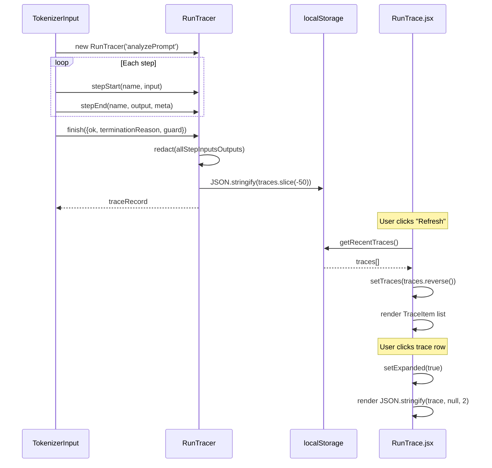

---

## 8. CI/CD Pipeline

How code changes flow from push to deployment.

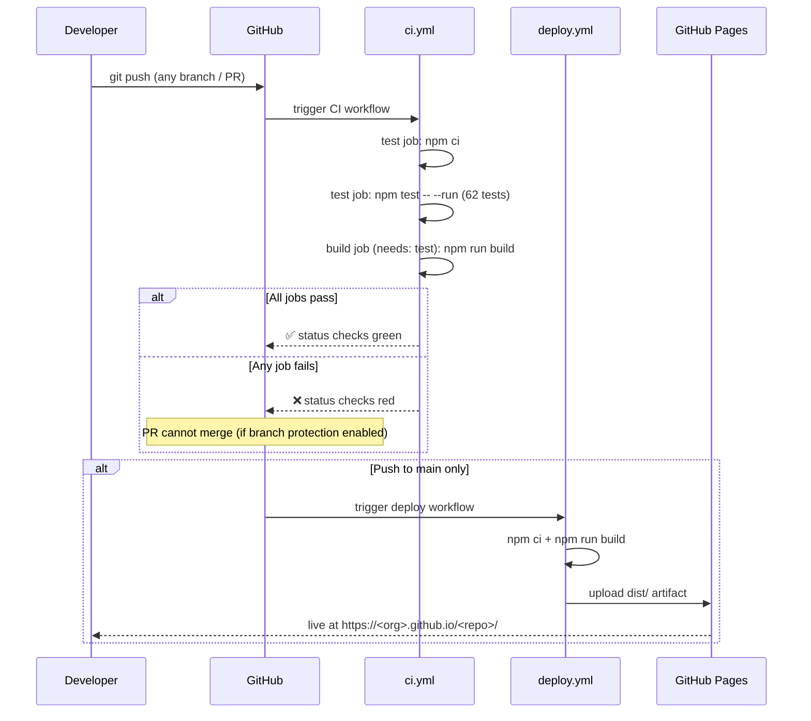

---

## 9. PDF Export Flow

How the "Export to PDF" button produces a downloadable report.

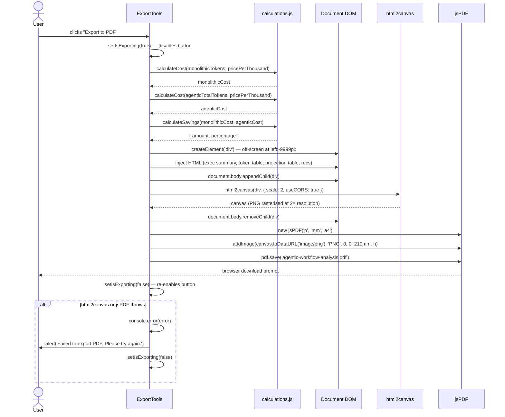

---

## 10. CSV Export Flow

How the "Export to CSV" button produces a downloadable spreadsheet.

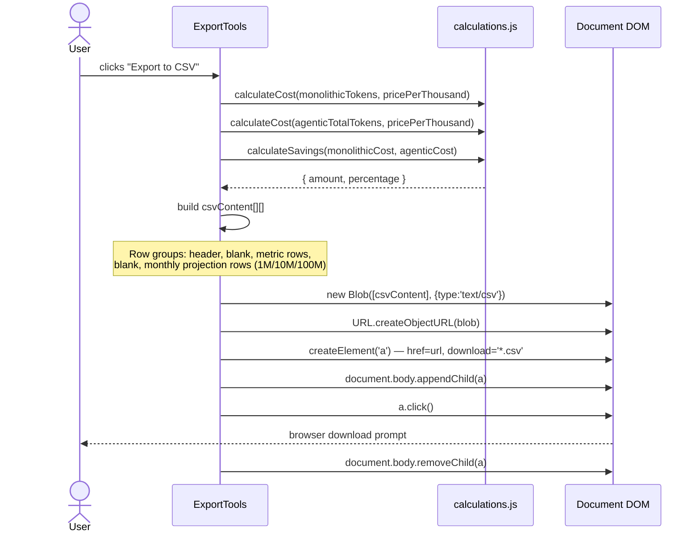

---

## 11. ELU Score Display Flow (BenchmarkMode)

How selecting a benchmark renders its Efficiency, Latency, and Utilization scores.

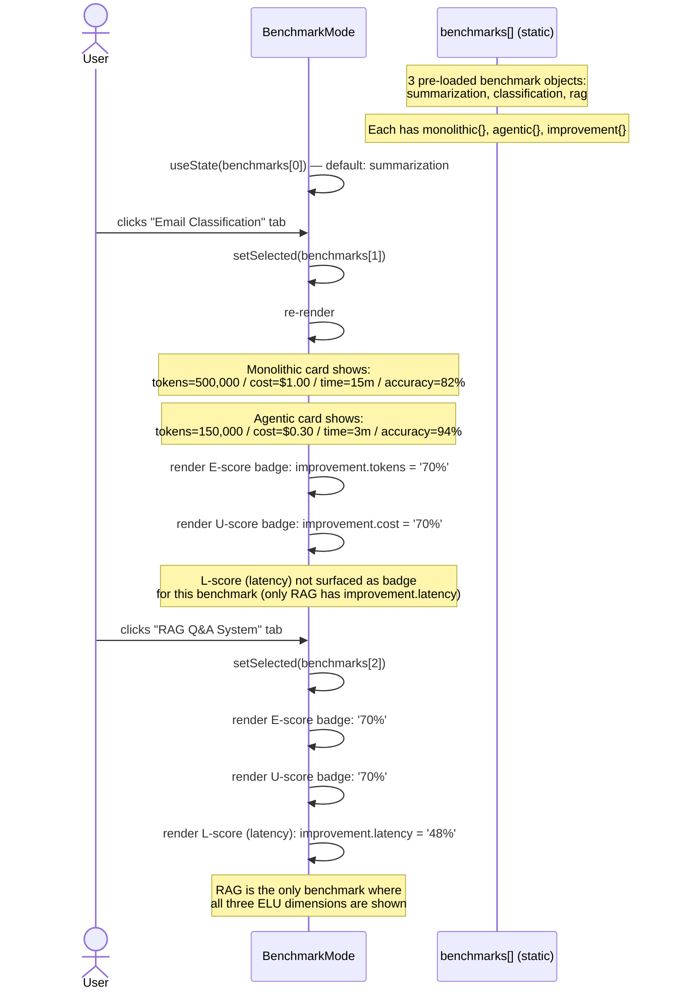

---

## 12. Gamification Achievement Unlock Flow

How achievement badges are evaluated and displayed as the user adjusts usage inputs.

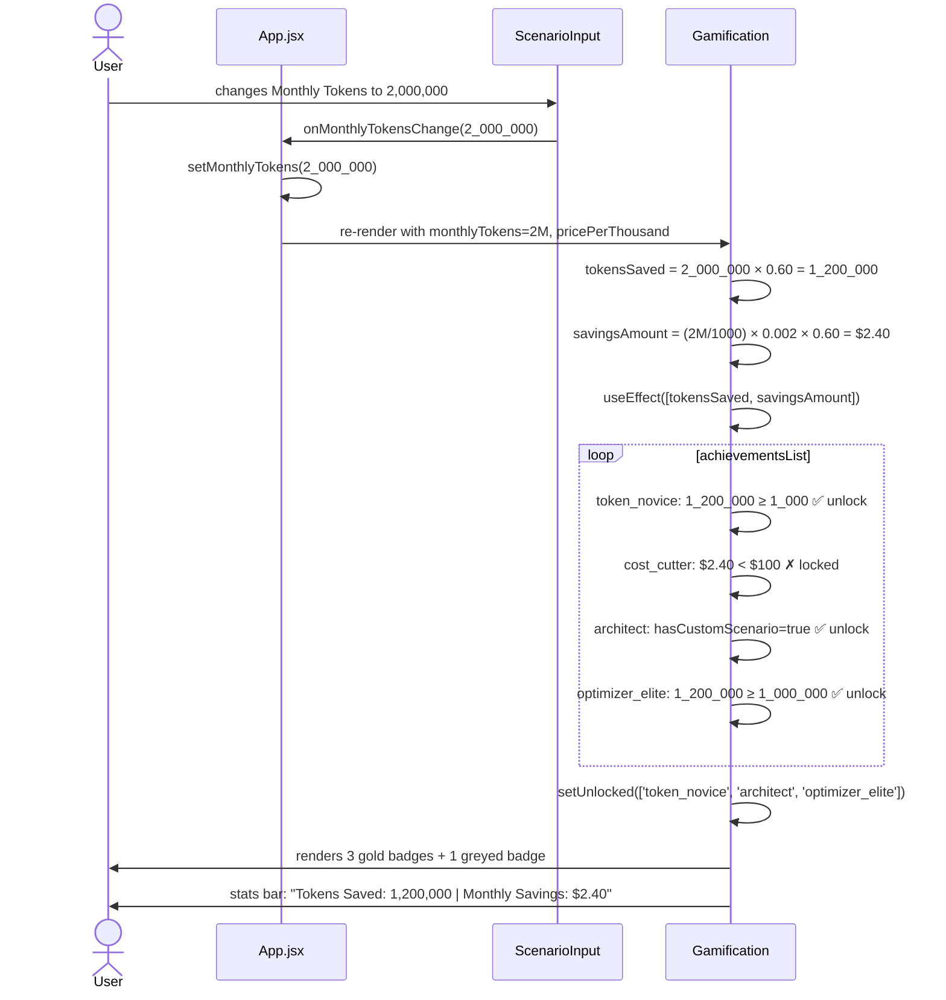
